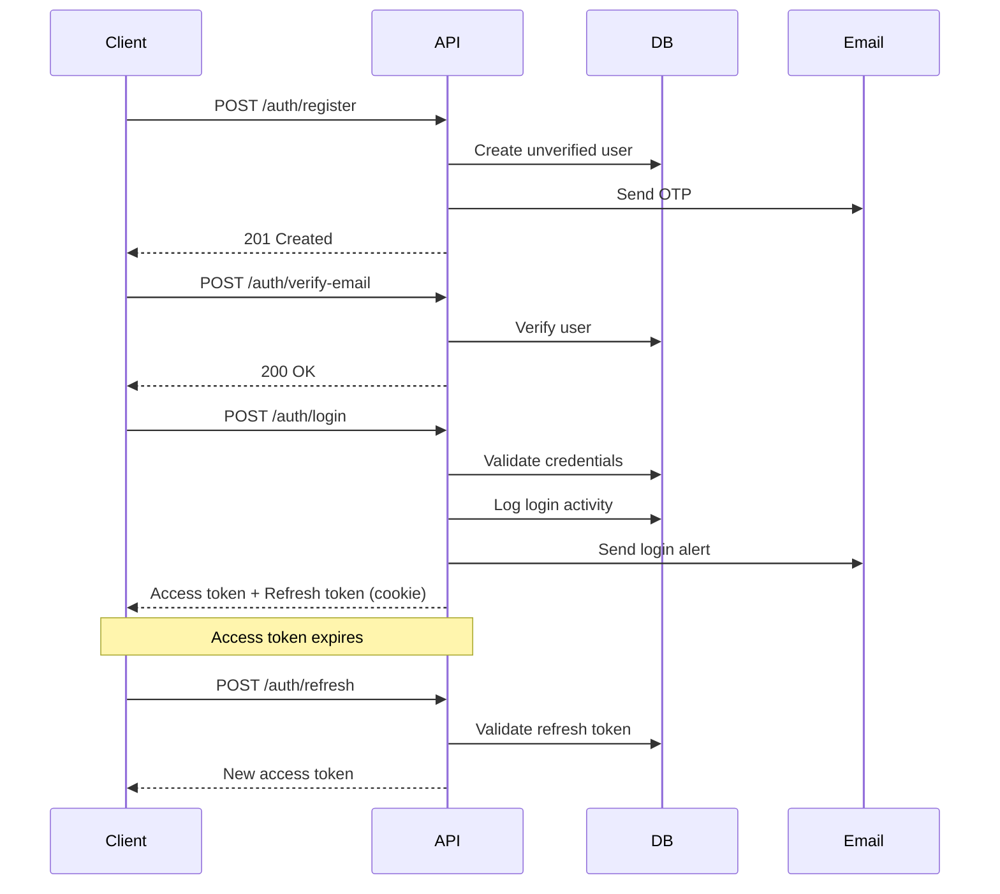

# Avisekh Bag Pashal – E-commerce Backend API

A robust, secure, and scalable RESTful API powering an e-commerce platform, built with **Node.js**, **Express**, **TypeScript**, **PostgreSQL**, and **TypeORM**, following production-grade authentication and security practices.

---

## 🌟 Features

### 🔐 Authentication & Authorization

* **JWT-based Authentication** (access & refresh tokens)
* **Secure token refresh mechanism**
* **Email verification** using OTP
* **Google OAuth 2.0** integration
* **Password reset** via time-limited OTP
* **Session management** with token versioning
* **Login activity tracking** (IP, device, location)
* **Email alerts** for new logins and password changes
* **Role-based access control** (Admin, Customer)

---

### 🤖 AI-Powered Shopping Assistant (RAG)

* **Gemini-powered Retrieval-Augmented Generation (RAG)**
* **Context-aware product Q&A** using internal store data
* **Natural language search & assistance**
* **Real-time streaming AI responses**
* **Grounded answers** (no hallucinated product data)
* **Read-only AI access** (no direct DB mutations)

**Primary use cases**

* Product discovery & explanations
* Product comparison assistance
* Order & policy-related questions
* Customer support chatbot foundation

---

### 💳 Payment Processing

* **eSewa integration** (Nepal)
* **Stripe integration** (international payments)
* **Cash on Delivery**
* **Secure payment verification**
* **Transaction history tracking**

---

### 📦 Order Management

* Order creation & lifecycle tracking
* Order status updates (Pending, Processing, Shipped, Delivered)
* Email notifications for each order stage
* Home delivery & store pickup options
* User order history

---

### 📧 Email System

* Transactional emails using **Resend**
* HTML-based responsive templates:

  * Account verification (OTP)
  * Password reset
  * Login alerts
  * Order confirmation
  * Order status updates
  * Account ban / unban notifications

---

### 🛡️ Security Features

* **bcrypt password hashing** (10 salt rounds)
* **HTTP-only, secure cookies** for refresh tokens
* **Rate limiting** on authentication routes
* **CORS protection**
* **Helmet security headers**
* **Zod-based input validation**
* **XSS & injection prevention**


---

### 🔧 Admin Capabilities

* User management (ban / unban / revoke sessions)
* Product CRUD operations
* Order management
* Basic analytics endpoints

---

## 🚀 Tech Stack

| Technology  | Purpose                    |
| ----------- | -------------------------- |
| Node.js     | Runtime                    |
| Express.js  | HTTP framework             |
| TypeScript  | Type safety                |
| PostgreSQL  | Relational database        |
| TypeORM     | ORM                        |
| JWT         | Authentication             |
| bcrypt      | Password hashing           |
| Resend      | Email delivery             |
| Zod         | Input validation           |
| ipapi.co    | IP geolocation             |
| UAParser.js | Device & browser parsing   |
| TSOA        | Route & OpenAPI generation |
| Swagger UI  | API documentation          |
| Gemini      | LLM for RAG system         |

---

## 🏗️ Project Structure

```text
src/
├── config/                 # App & environment configuration
│   ├── db.config.ts
│   └── mail.config.ts
├── controllers/            # TSOA controllers
│   ├── auth.controller.ts
│   ├── product.controller.ts
│   └── order.controller.ts
├── middlewares/            # Express middlewares
│   ├── auth.middleware.ts
│   ├── validation.middleware.ts
│   └── error.middleware.ts
├── routes/                 # Auto-generated TSOA routes
├── services/               # Business logic
│   ├── auth/
│   ├── mail/
│   ├── payment/
│   └── ai/                 # Gemini RAG logic
├── entities/               # TypeORM entities
├── utils/                  # Helpers (JWT, validation, etc.)
├── types/                  # Shared TypeScript types
└── index.ts                # Application entry point
```

---

## 📡 API Documentation

### Swagger UI

The API is fully documented using **TSOA + Swagger UI**.

```
http://localhost:8000/docs
```

**Highlights**

* Interactive endpoint testing
* JWT-protected routes
* Request/response schemas
* Auto-generated OpenAPI 3.0 spec
* `/swagger.json` available for client generation

---

## 🔐 Authentication Flow



---


## 🔒 Security Best Practices

* Short-lived access tokens (15 minutes)
* Refresh tokens stored in HTTP-only cookies
* Token versioning for instant session revocation
* Rate-limited auth endpoints
* Input validation on every request
* Secure cookie & CORS configuration
* Production-safe error handling

---


## 👨‍💻 Author

**Shankar Poudel**


